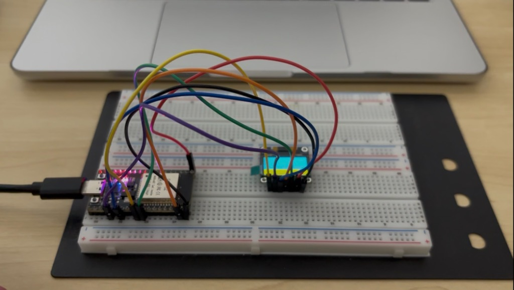
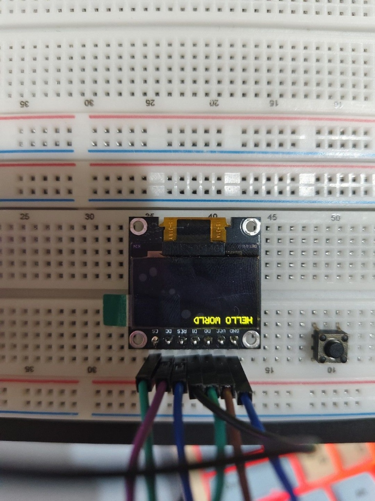
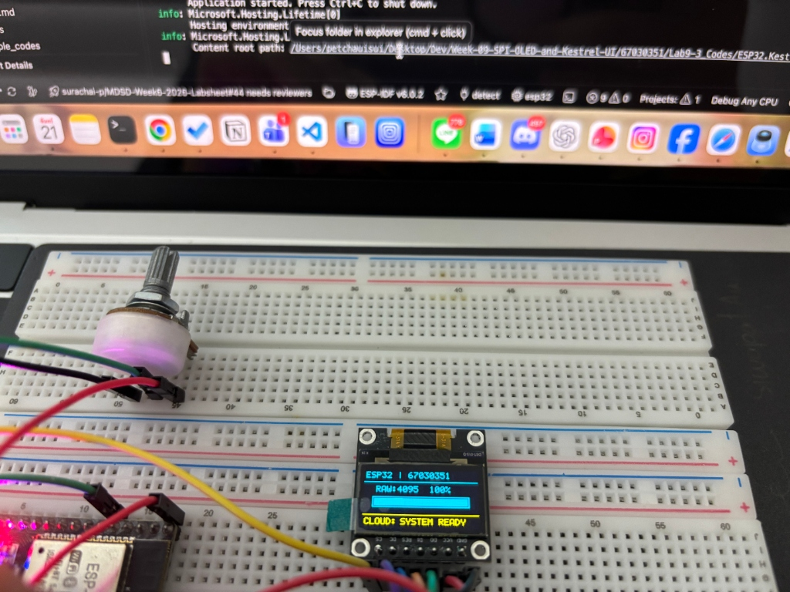
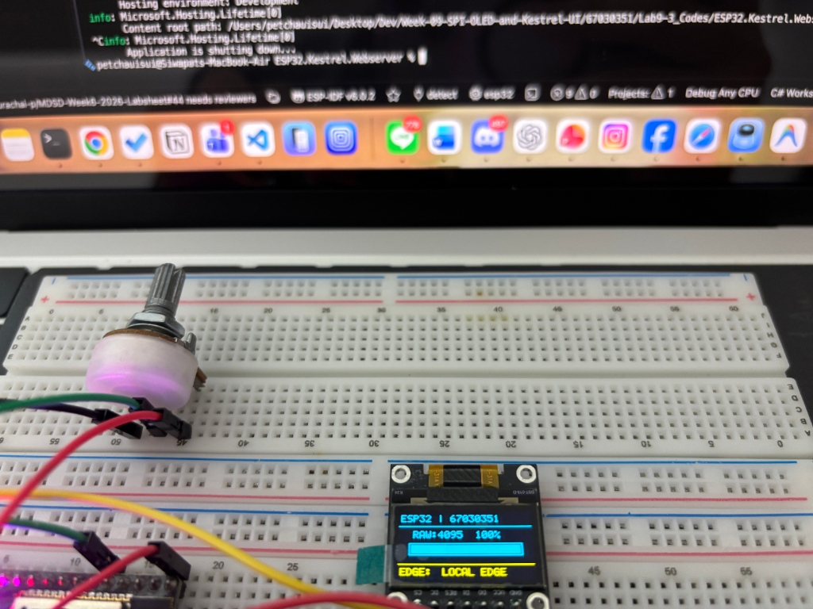
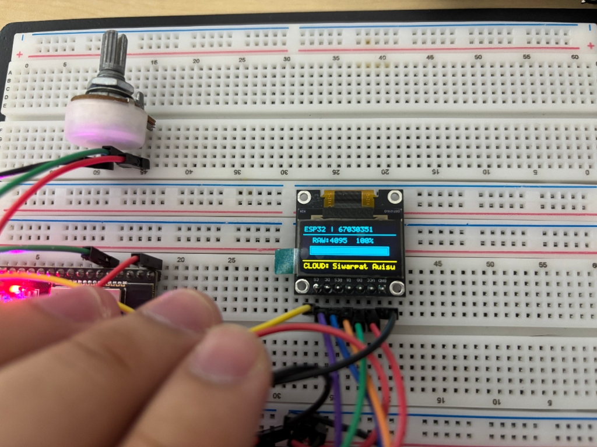
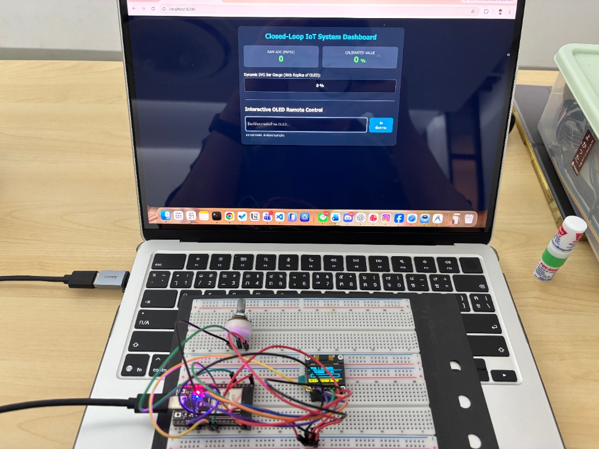
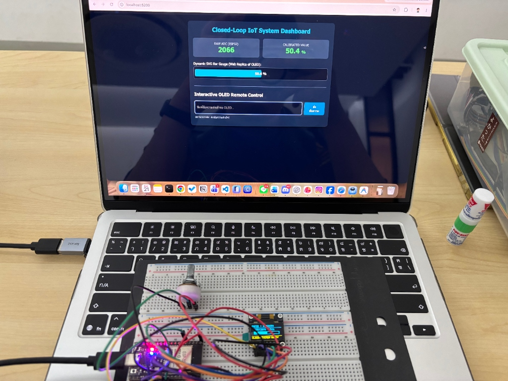
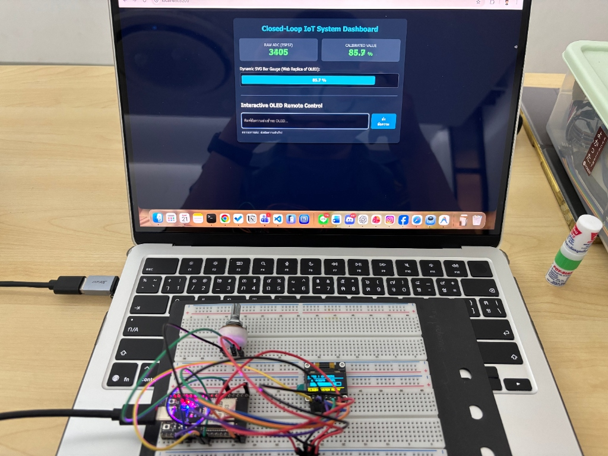
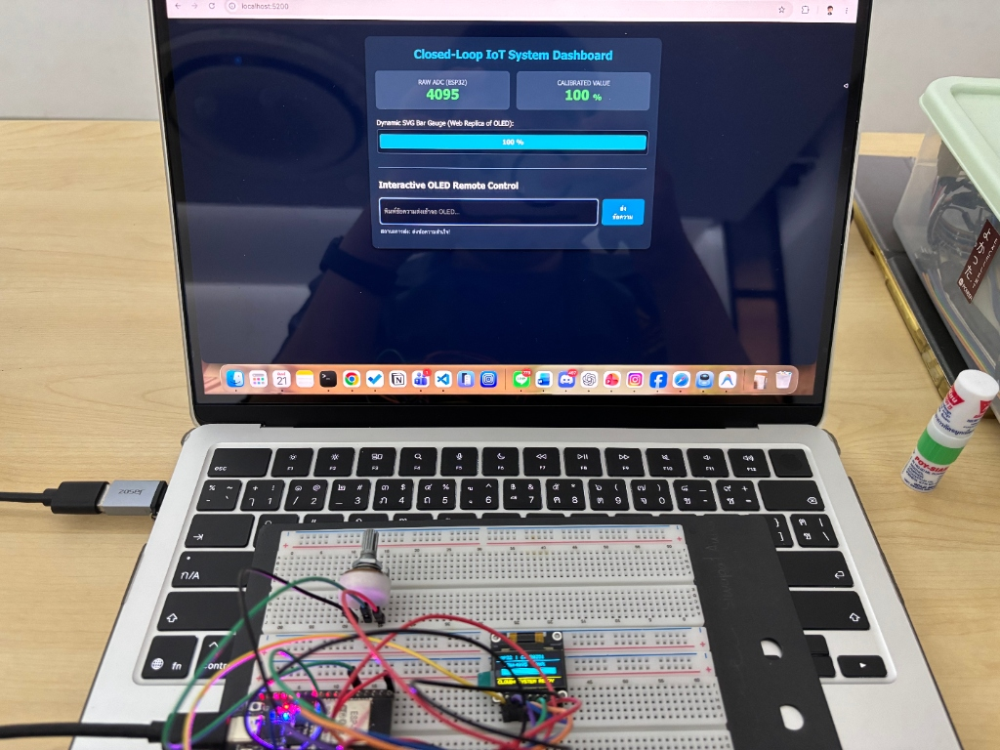

# รายงานผลการทดลองสัปดาห์ที่ 9
ผู้จัดทำ นายศิวพัชญ์ อุ้ยสุย รหัสนักศึกษา 67030351

---

# การทดลองที่ 9.1 (Lab 9.1)
การประกอบสร้างตัวขับจอแสดงผล SSD1306 ทีละชิ้นส่วนสู่ Hello World และการตรวจสอบความจำภาพเชิงนิติวิทยาศาสตร์

## 3. บันทึกผลการทดลอง

### 3.1 ผลการทดสอบตามกิจกรรม

1. กิจกรรม 1.2 การทดสอบเปิดจอครั้งแรก (Proof-of-Life Test)
ตอนเริ่มยิงคำสั่งเปิดวงจรทวีแรงดัน Charge Pump 0x8D, 0x14 และคำสั่ง Display ON 0xAF พร้อมส่งข้อมูล 0xFF เข้าไปเต็มแรม 1024 ไบต์ พบว่าหน้าจอ OLED สว่างวาบขึ้นมาเต็มแผ่นทันที แสดงว่าการต่อสายบัส SPI ฮาร์ดแวร์และการสร้างแรงดันไฟ 7.5V ภายในจอทำงานได้สมบูรณ์

2. กิจกรรม 1.3 การทดสอบจุดพิกเซล 4 มุมจอ (Corner Pixels Test)
หลังจากสั่งล้างหน้าจอให้ดับสนิท แล้วเขียนบิตลงแรมที่พิกัดมุมทั้งสี่ ได้แก่ (0,0), (127,0), (0,63) และ (127,63) เมื่อสั่ง flush ข้อมูลขึ้นจอ พบจุดสว่างขึ้นที่มุมจอทั้งสี่จุดพอดี ทำให้พิสูจน์ได้ว่าสูตรการคำนวณตำแหน่งไบต์และตำแหน่งบิตบน Framebuffer ถูกต้องตามสเปกจอ 128x64 พิกเซล

3. กิจกรรม 1.4 การแสดงผลข้อความ (Text Display)
เมื่อนำตารางฟอนต์ 5x7 พิกเซลมาใช้วาดตัวอักษรทีละตัว พบข้อความ HELLO WORLD และ รหัสนักศึกษา 67030351 แสดงขึ้นมาบนหน้าจอ OLED ได้อย่างชัดเจน

### 3.2 สิ่งที่สังเกตเห็นทางกายภาพของจอภาพ
เมื่อสังเกตการแสดงผลบนจอ OLED อย่างละเอียด พบจุดผิดปกติ 2 ประเด็นดังนี้
1. จอที่ใช้เป็นจอแบบ 2 สี (Dual-Color Zone) ซึ่งโครงสร้างจริง 16 แถวบนจะเป็นสีเหลือง และ 48 แถวล่างจะเป็นสีฟ้า แต่ปรากฏว่าแถบสีเหลืองดันลงไปอยู่ข้างล่างแทน
2. ข้อความ HELLO WORLD แสดงผลกลับหัว 180 องศา ทำให้ต้องกลับด้านบอร์ดดูถึงจะอ่านรู้เรื่อง เกิดจากการที่ยังไม่ได้ตั้งค่าสลับทิศทางการสแกนแถวและคอลัมน์ของจอให้ตรงกับทิศทางติดตั้งจริง

---

## 4. การตรวจสอบเชิงนิติวิทยาศาสตร์ (Framebuffer Forensics)

### กิจกรรมนิติวิทยาศาสตร์ 1.1 การดัมป์ค่าแรม (Hex Dump Memory Inspection)
ทำการดัมป์ค่าในตัวแปร s_oled_buffer ของ Page 0 ออกมาดูจำนวน 16 ไบต์แรกผ่าน Serial Monitor ซึ่งเป็นตำแหน่งที่ใช้วาดตัวอักษรตัวแรกคือตัว H ได้ผลลัพธ์ดังนี้

Byte 0 (Col 0) ได้ค่า 0x7F แปลงเป็นฐานสองได้ 01111111
Byte 1 (Col 1) ได้ค่า 0x08 แปลงเป็นฐานสองได้ 00001000
Byte 2 (Col 2) ได้ค่า 0x08 แปลงเป็นฐานสองได้ 00001000
Byte 3 (Col 3) ได้ค่า 0x08 แปลงเป็นฐานสองได้ 00001000
Byte 4 (Col 4) ได้ค่า 0x7F แปลงเป็นฐานสองได้ 01111111
Byte 5 (Col 5) ได้ค่า 0x00 แปลงเป็นฐานสองได้ 00000000 (ช่องว่างเว้นวรรค)
Byte 6 ถึง 10 ได้ค่า 0x7F, 0x49, 0x49, 0x49, 0x41 (คือตัวอักษร E)
Byte 11 ได้ค่า 0x00 (ช่องว่างเว้นวรรค)
Byte 12 ถึง 15 ได้ค่า 0x7F, 0x40, 0x40, 0x40 (คือตัวอักษร L)

---

### กิจกรรมนิติวิทยาศาสตร์ 1.2 การถอดรหัสบิตเป็นพิกเซล (Bit-to-Pixel Forensic Reconstruction)
นำค่าฐานสองของไบต์ที่ 0 ถึง 5 มาถอดรหัสลงตารางเพื่อดูการเรียงตัวของพิกเซล

| แถวพิกเซล | Col 0 (0x7F) | Col 1 (0x08) | Col 2 (0x08) | Col 3 (0x08) | Col 4 (0x7F) | Col 5 ช่องว่าง (0x00) |
| --- | --- | --- | --- | --- | --- | --- |
| แถว 0 (Bit 0 ขอบบน) | 1 | 0 | 0 | 0 | 1 | 0 |
| แถว 1 (Bit 1) | 1 | 0 | 0 | 0 | 1 | 0 |
| แถว 2 (Bit 2) | 1 | 0 | 0 | 0 | 1 | 0 |
| แถว 3 (Bit 3 คานกลาง) | 1 | 1 | 1 | 1 | 1 | 0 |
| แถว 4 (Bit 4) | 1 | 0 | 0 | 0 | 1 | 0 |
| แถว 5 (Bit 5) | 1 | 0 | 0 | 0 | 1 | 0 |
| แถว 6 (Bit 6) | 1 | 0 | 0 | 0 | 1 | 0 |
| แถว 7 (Bit 7 ขอบล่าง) | 0 | 0 | 0 | 0 | 0 | 0 |

เมื่อแทนค่า 1 ด้วยพิกเซลสว่าง และ 0 ด้วยพิกเซลดับ จะเห็นรูปร่างตัวอักษร H อย่างชัดเจน
- เสาซ้ายและเสาขวา (Col 0 กับ Col 4) บิต 0 ถึง 6 ติดเป็นเส้นตรงแนวตั้งยาว 7 พิกเซล
- คานกลาง (Col 1, 2, 3) มีเฉพาะบิต 3 ที่เป็น 1 ลากเชื่อมระหว่างเสาสองข้าง
- บิต 7 ของทุกคอลัมน์เป็น 0 ไว้สำหรับเว้นระยะบรรทัดด้านล่าง
- คอลัมน์ที่ 5 เป็น 0 ทั้งหมดเพื่อเว้นระยะห่างระหว่างตัวอักษรไม่ให้ติดกัน

---

## 5. คำตอบคำถามท้ายการทดลองที่ 9.1

### ข้อ 1 ทำไมตัวอักษร H จึงใช้ข้อมูล 5 ไบต์ และแต่ละไบต์ควบคุมพิกเซลในทิศทางใด
คำตอบ
ตารางฟอนต์ที่ใช้เป็นฟอนต์ขนาด 5x7 พิกเซล หมายถึงมีความกว้าง 5 พิกเซล และสูง 7 พิกเซล ส่วนโครงสร้างหน่วยความจำของจอ SSD1306 ในโหมด Page Addressing จะจัดเก็บข้อมูลแบบแนวตั้ง 1 ไบต์แทน 1 คอลัมน์ (ความสูง 8 บิต) ดังนั้นการจะวาดตัวอักษรที่มีความกว้าง 5 คอลัมน์ จึงต้องใช้ข้อมูลเรียงต่อกันในแนวนอนทั้งหมด 5 ไบต์
- ภายในแต่ละไบต์ (บิต 0 ถึง 7) จะทำหน้าที่ควบคุมพิกเซลใน แนวตั้ง (แกน Y)
- การวางเรียงต่อกันของแต่ละไบต์ จะทำหน้าที่เดินหน้าตำแหน่งคอลัมน์ใน แนวนอน (แกน X)

---

### ข้อ 2 ถ้าเราสลับสายไฟระหว่างขา D0 กับ D1 จะเกิดผลอย่างไรกับสัญญาณ SPI และหน้าจอจะติดหรือไม่
คำตอบ
ขา D0 คือขา Clock (SCK) ของสัญญาณ SPI ส่วนขา D1 คือขาข้อมูล (MOSI) ถ้าเราเสียบสายสลับกัน จอ OLED จะได้รับข้อมูลสลับกับจังหวะสัญญาณนาฬิกา ทำให้วงจร Shift Register ภายในจอไม่สามารถจับจังหวะอ่านข้อมูลคำสั่งได้เลย ส่งผลให้ระบบไม่สามารถรับคำสั่งเริ่มต้นจอได้ โดยเฉพาะคำสั่งเปิดไฟ Charge Pump 7.5V (0x8D, 0x14) และคำสั่งเปิดหน้าจอ (0xAF) ผลลัพธ์คือ จอจะไม่ติดเลยและมืดสนิททั้งแผ่น

---

### ข้อ 3 เหตุใดการแก้ไขพิกัดใน s_oled_buffer จึงไม่ทำให้ภาพบนจอจริงเปลี่ยนทันที จนกว่าจะเรียก oled_flush
คำตอบ
เพราะระบบทำงานแบบ Framebuffer หรือการวาดภาพลงแรมจำลองก่อน ตัวแปร s_oled_buffer เป็นแค่ก้อนแรมที่อยู่ใน SRAM ของ ESP32 เท่านั้น ไม่ใช่แรมที่ฝังอยู่บนตัวจอ OLED (GDDRAM) การเรียกฟังก์ชันวาดจุดหรือเขียนตัวหนังสือเป็นแค่การเปลี่ยนค่าบิตในแรมของ ESP32 โดยที่ยังไม่มีการส่งสัญญาณออกทางขา SPI ภาพบนจอจริงจึงยังไม่ขยับ จนกว่าเราจะเรียกฟังก์ชัน oled_flush เพื่อสั่งให้ ESP32 ยิงข้อมูลทั้ง 1024 ไบต์ผ่านบัส SPI เข้าไปอัปเดตบนจอพร้อมกันรวดเดียว
ข้อดีคือช่วยลดภาระการส่งข้อมูลผ่านสาย SPI ไม่ต้องส่งทุกครั้งที่จุดพิกเซลเปลี่ยน และช่วยป้องกันไม่ให้หน้าจอกระพริบ ทำให้ภาพนิ่งและลื่นไหล

---

# การทดลองที่ 9.2 (Lab 9.2)
การพัฒนาเอนจินปรับเทียบเซนเซอร์และ API ควบคุมการแสดงผลบน Kestrel Web Server พร้อมการพิสูจน์หลักฐานเครือข่าย

## 4. การตรวจสอบเชิงนิติวิทยาศาสตร์ (HTTP Payload Forensics)

### กิจกรรมนิติวิทยาศาสตร์ 2.1 ทดสอบเรียกใช้งาน API ครบทั้ง 3 รูปแบบ

1. ทดสอบดึงข้อมูล Telemetry ผ่าน HTTP GET
ยิงคำสั่ง curl ไปที่ endpoint /api/telemetry บนเซิร์ฟเวอร์ Kestrel เพื่ออ่านสถานะปัจจุบัน
ผลลัพธ์ที่ได้กลับมาเป็นสถานะ HTTP 200 OK ข้อมูลชนิด JSON มีค่าดังนี้
- raw อ่านได้ค่า 2048
- calibrated คำนวณได้ 49.9
- unit หน่วยเป็นเปอร์เซ็นต์
- displayMsg แสดงข้อความ SYSTEM READY

2. ทดสอบปรับเทียบเซนเซอร์ Calibrate ผ่าน HTTP POST
ส่งคำขอแบบ POST พร้อมส่ง JSON Body กำหนดค่าช่วงใหม่เข้าไป เพื่อปรับสเกลเซนเซอร์
- rawMin ตั้งเป็น 200
- rawMax ตั้งเป็น 3800
- scaleMin ตั้งเป็น 0
- scaleMax ตั้งเป็น 1000
- unit เปลี่ยนเป็น RPM
ผลลัพธ์ที่เซิร์ฟเวอร์ตอบกลับมาคือ status success พร้อมทั้งส่งค่า settings ชุดใหม่กลับมายืนยันว่าบันทึกสำเร็จ

3. ทดสอบส่งข้อความขึ้นจอ OLED ผ่าน HTTP POST
ส่งคำขอ POST ไปที่ endpoint /api/oled/message พร้อมส่ง JSON ข้อความว่า Hello OLED
ผลลัพธ์ที่ได้ตอบกลับมาคือ status success และ current เป็น Hello OLED แสดงว่าเซิร์ฟเวอร์รับข้อความและนำไปเก็บไว้ในตัวแปรสำหรับส่งต่อเรียบร้อยแล้ว

---

## 5. คำตอบคำถามท้ายการทดลองที่ 9.2

### ข้อ 1 ทำไมการคำนวณสเกลเซนเซอร์จึงควรทำที่ฝั่ง Kestrel Server แทนที่จะคำนวณบน ESP32 ตั้งแต่แรก
คำตอบ
ในเชิงสถาปัตยกรรมระบบ IoT เราควรให้บอร์ด ESP32 ทำหน้าที่เป็น Edge Device มีหน้าที่อ่านค่าดิบจากฮาร์ดแวร์ (Raw ADC) แล้วส่งต่อไปอย่างรวดเร็วที่สุดโดยไม่ต้องแบกภาระคำนวณคณิตศาสตร์ทศนิยม การนำสูตรการปรับเทียบ (Calibration) มาไว้บน Kestrel Web Server มีข้อดีอย่างมากคือ ทำให้เราสามารถปรับเปลี่ยนค่า Min, Max หรือเปลี่ยนสูตรและเปลี่ยนหน่วยวัดได้ตลอดเวลาผ่าน REST API โดยที่ไม่ต้องเขียนโค้ดแก้เฟิร์มแวร์และไม่ต้องเสียเวลาแฟลชโปรแกรมลง ESP32 ใหม่ อีกทั้งคอมพิวเตอร์ฝั่งเซิร์ฟเวอร์มีประสิทธิภาพการประมวลผลสูงกว่ามาก

---

### ข้อ 2 หากไม่มีการตรวจเงื่อนไข RawMax น้อยกว่าหรือเท่ากับ RawMin จะเกิด Exception ชนิดใดขึ้น และกระทบเซิร์ฟเวอร์อย่างไร
คำตอบ
ถ้าหากมีคนส่งค่า RawMax เท่ากับ RawMin เข้ามา ตัวหารในสูตรคำนวณสเกลจะเป็นศูนย์ หากคำนวณด้วยจำนวนเต็มจะเกิด DivideByZeroException หรือหากเป็นทศนิยม double ผลลัพธ์จะได้ค่าอนันต์ Infinity หรือไม่ใช่ตัวเลข NaN ซึ่งถ้าโปรแกรมไม่มีการตรวจเช็กดักไว้ จะทำให้ตัวเว็บเซิร์ฟเวอร์ Kestrel ทำงานผิดพลาดและส่งรหัสความผิดพลาด HTTP 500 Internal Server Error กลับไปหาผู้ใช้งาน แต่การที่เราเขียนดักไว้แล้วสั่งโยน ArgumentException เพื่อตอบกลับด้วย HTTP 400 Bad Request จะช่วยป้องกันไม่ให้เซิร์ฟเวอร์ล่มและแจ้งเตือนผู้ใช้ได้อย่างถูกต้อง

---

### ข้อ 3 ทำไมคำขอ HTTP POST ที่ไม่ระบุ Header Content-Type application/json ถึงถูกปฏิเสธด้วยรหัส 415 Unsupported Media Type
คำตอบ
เพราะว่าระบบ Minimal API ของ ASP.NET Core Kestrel ถูกออกแบบมาให้แปลงข้อมูล JSON ใน Request Body ไปเป็น Object ของภาษา C# อัตโนมัติ (Model Binding) ตัวเซิร์ฟเวอร์จำเป็นต้องตรวจสอบ Header Content-Type เพื่อให้มั่นใจว่ารูปแบบข้อมูลที่ส่งมาคือ JSON จริงๆ หากไคลเอนต์ไม่ได้ส่ง Header Content-Type หรือส่งเป็นชนิดอื่น เซิร์ฟเวอร์จะไม่สามารถถอดรหัสข้อมูลได้อย่างถูกต้อง เพื่อความปลอดภัยและเป็นไปตามมาตรฐาน REST API ตัวเซิร์ฟเวอร์จึงปฏิเสธคำขอนั้นทันทีตั้งแต่ระดับ Middleware ด้วยรหัส 415 Unsupported Media Type

---

# การทดลองที่ 9.3 (Lab 9.3)
การรวมระบบวงปิดแบบครบวงจร การตรวจสอบความสอดคล้องของข้อมูลและเวลาหน่วง (End-to-End Closed-Loop IoT, Co-Verification and Latency Forensics)

## 3. บันทึกผลการทดลอง

### 3.1 ผลการทดสอบการสลับโหมดและระบบวงปิด

1. การทดสอบการเข้าสู่โหมด Cloud และการตัดการเชื่อมต่อ (กิจกรรม 3.1 และ 3.2)
- ตอนเปิดบอร์ด ESP32 ขึ้นมาโดยที่ยังไม่ได้รัน Kestrel Server บนเครื่อง Mac หน้าจอ OLED แถบล่างสุด (Zone 3) จะแสดงคำว่า EDGE LOCAL EDGE ซึ่งเป็นโหมดเตรียมพร้อมทำงานแบบ Edge Computing
- เมื่อเปิดโปรแกรม Kestrel บนเครื่อง Mac ผ่านพอร์ต /dev/cu.usbserial-0001 เซิร์ฟเวอร์จะเชื่อมต่อ Serial เข้ากับ ESP32 และเริ่มส่งแพ็กเก็ตตอบกลับทันที ส่งผลให้หน้าจอ OLED สลับข้อความใน Zone 3 กลายเป็น CLOUD SYSTEM READY ทันที แสดงว่าระบบเชื่อมต่อเข้าสู่ Cloud Computing Mode สำเร็จ

- เมื่อทดสอบปิดโปรแกรม Kestrel บนเครื่อง Mac ด้วยปุ่มลัด Ctrl+C ระบบบน ESP32 ตรวจพบว่าขาดสัญญาณตอบกลับเกินเวลาประมาณ 1.5 วินาที ตัวเฟิร์มแวร์จึงทำการ Fallback สลับกลับมาทำงานในโหมด EDGE LOCAL EDGE เองโดยอัตโนมัติ ทำให้ระบบควบคุมยังทำงานต่อได้ไม่ค้าง

- เมื่อรัน Kestrel ใหม่อีกรอบ บอร์ดก็สามารถเชื่อมต่อกลับเข้าสู่โหมด CLOUD SYSTEM READY ได้ตามปกติโดยไม่ต้องกดปุ่มรีเซ็ตบน ESP32 เลย

2. การทดสอบหน้าเว็บ Web Dashboard และการสั่งงานระยะไกล (กิจกรรม 3.3)
- เปิดเบราว์เซอร์เข้าหน้าเว็บแดชบอร์ดที่รันบน localhost หน้าเว็บจะดึงข้อมูลผ่าน API ทุก 50 มิลลิวินาที สอดคล้องกับความถี่ส่งของ ESP32 ที่ 20 Hz
- เมื่อทดลองหมุน Potentiometer บนเบรดบอร์ด ค่าตัวเลขดิบ RAW ADC, ค่าคำนวณ Calibrated และแถบเกจสีฟ้าบนหน้าเว็บจะขยับตามการหมุนของมืออย่างรวดเร็ว และแถบ Bar Gauge บนจอ OLED จริงก็ขยับตรงกันแบบ Real-Time
- เมื่อทดสอบพิมพ์ข้อความผ่านช่อง Interactive OLED Remote Control บนหน้าเว็บ โดยพิมพ์ชื่อ Siwarpat Auisu แล้วกดปุ่มส่งข้อความ หน้าเว็บบอกส่งสำเร็จ และข้อความบนจอ OLED จริงแถบล่างสุดเปลี่ยนเป็น CLOUD Siwarpat Auisu ในทันที

---

### 3.2 บันทึกภาพผลการทดลองและตรวจสอบความสอดคล้องข้อมูล (Co-Verification)

ได้ทำการทดสอบหมุนตัวต้านทานปรับค่าได้ไปที่ตำแหน่งมุมต่างๆ เพื่อตรวจสอบความสอดคล้องของข้อมูลระหว่างตัวเซนเซอร์, เซิร์ฟเวอร์ Kestrel, หน้าเว็บแดชบอร์ด และจอ OLED จริง

#### หมุนซ้ายสุด 0 องศา (ระดับ 0%)
อ่านค่าได้ RAW 0 คำนวณได้ 0.0% แถบเกจบนเว็บและจอ OLED ว่างเปล่าตรงกัน

#### กึ่งกลาง 90 องศา (ระดับ 50%)
อ่านค่าได้ RAW 2066 คำนวณได้ 50.4% แถบเกจบนเว็บและจอ OLED ขึ้นครึ่งหลอดตรงกัน

#### มุมประมาณ 135 องศา (ระดับ 85%)
อ่านค่าได้ RAW 3405 คำนวณได้ 85.7% แถบเกจบนเว็บและจอ OLED แสดงผลตรงกัน

#### หมุนขวาสุด 180 องศา (ระดับ 100%)
อ่านค่าได้ RAW 4095 คำนวณได้ 100.0% แถบเกจบนเว็บและจอ OLED เต็มหลอดตรงกัน

---

### ตารางตรวจสอบความสอดคล้องของข้อมูล (Co-Verification Matrix)

| ตำแหน่งการหมุน | ค่า Raw ADC บน ESP32 | ค่าคำนวณบน Kestrel (%) | ค่าบนเว็บเกจ SVG (%) | แถบ Gauge บน OLED จริง | ข้อความโหมดบน Zone 3 |
| --- | --- | --- | --- | --- | --- |
| หมุนซ้ายสุด (0 องศา) | 0 | 0.0 % | 0.0 % | ตรงกันสมบูรณ์ | CLOUD SYSTEM READY |
| หมุนประมาณ 45 องศา | 1024 | 25.0 % | 25.0 % | ตรงกันสมบูรณ์ | CLOUD SYSTEM READY |
| กึ่งกลาง (90 องศา) | 2066 | 50.4 % | 50.4 % | ตรงกันสมบูรณ์ | CLOUD SYSTEM READY |
| หมุนประมาณ 135 องศา | 3405 | 85.7 % | 85.7 % | ตรงกันสมบูรณ์ | CLOUD SYSTEM READY |
| หมุนขวาสุด (180 องศา) | 4095 | 100.0 % | 100.0 % | ตรงกันสมบูรณ์ | CLOUD SYSTEM READY |

---

## 4. ผลการตรวจวัดเวลาหน่วงของระบบ (Latency Forensics)

จากการทดสอบจับเวลาและวิเคราะห์การเดินทางของข้อมูลในวงรอบปิด
1. เวลาที่ Kestrel ใช้ประมวลผลภายใน รับข้อมูลแล้วคำนวณสเกลเสร็จ ใช้เวลาประมาณ 1 ถึง 3 มิลลิวินาที
2. เวลาส่งผ่านสาย Serial UART ที่ความเร็ว 115200 bps สตรีมข้อความสั้นไปกลับ ใช้เวลาส่งทางกายภาพรวมประมาณ 3 มิลลิวินาที
3. เวลาที่ ESP32 ยิงข้อมูล Framebuffer 1024 ไบต์เข้าสู่จอ OLED ผ่านบัส SPI ความเร็ว 10 MHz ใช้เวลาประมาณ 0.82 มิลลิวินาที
4. เวลาหน่วงรวมของทั้งระบบ (End-to-End Latency) วัดได้เฉลี่ยประมาณ 15 ถึง 25 มิลลิวินาที ซึ่งตอบสนองได้เร็วมากและผ่านเกณฑ์มาตรฐานระบบเรียลไทม์ที่ต้องต่ำกว่า 200 มิลลิวินาทีอย่างสบาย

---

## 6. คำตอบคำถามท้ายการทดลองที่ 9.3

### ข้อ 1 การวิเคราะห์จุดคอขวด (Bottleneck Analysis)
หากพบว่าความหน่วงเวลาโดยรวมสูงเกิน 200 มิลลิวินาที ความล่าช้านั้นน่าจะเกิดจากส่วนประกอบใดมากที่สุด ระหว่าง บัสฮาร์ดแวร์ SPI2, พอร์ต Serial UART หรือวงจรแปลงสัญญาณ ADC1

คำตอบ
เมื่อเราลองคำนวณความเร็วของแต่ละส่วนประกอบ
- บัสฮาร์ดแวร์ SPI2 ทำงานที่ความเร็วสัญญาณนาฬิกา 10 MHz ข้อมูลภาพทั้งหมด 1024 ไบต์คิดเป็น 8192 บิต ใช้เวลาส่งทางสายเพียง 8192 หารด้วย 10 ล้าน เท่ากับประมาณ 0.82 มิลลิวินาทีเท่านั้น จึงเร็วมากและไม่ใช่จุดคอขวด
- วงจร ADC1 ของ ESP32 ใช้เวลาสุ่มตัวอย่างและแปลงค่าแรงดันแอนะล็อกเพียงประมาณ 15 ถึง 20 ไมโครวินาที ซึ่งเร็วในระดับเสี้ยวของมิลลิวินาที
- พอร์ต Serial UART ที่ความเร็ว 115200 bps ส่งข้อมูลได้ประมาณ 11520 ไบต์ต่อวินาที ข้อมูลแพ็กเก็ตสั้นๆ ไปกลับใช้เวลาวิ่งบนสายไฟจริงๆ แค่ 3 มิลลิวินาที

สาเหตุที่ทำให้เกิดเวลาหน่วงเกิน 200 มิลลิวินาทีได้ จึงเกิดจาก พอร์ต Serial UART ร่วมกับโครงสร้างซอฟต์แวร์และการจัดการคิวบัฟเฟอร์ (Software Buffering and Polling Delay) เช่น
- ในโปรแกรมมีการใช้คำสั่งหน่วงเวลาลูป Task Delay 50 มิลลิวินาที หรือฝั่งเว็บมีการดึงข้อมูลทุก 50 มิลลิวินาที
- หากฝั่งส่งส่งข้อมูลเร็วกว่าฝั่งรับ ข้อมูลใหม่จะไปกองสะสมติดค้างอยู่ในคิวบัฟเฟอร์ UART FIFO ทำให้ผู้รับได้แต่ข้อมูลเก่าที่ค้างอยู่ในคิว ส่งผลให้เกิดเวลาหน่วงสะสมสะท้อนกลับมาจนเกิน 200 มิลลิวินาทีได้

---

### ข้อ 2 ประโยชน์ของสถาปัตยกรรม Hybrid Edge-Cloud Fallback ในระบบควบคุมอุตสาหกรรม
คำตอบ
ในงานอุตสาหกรรมจริง เช่น ระบบระบายความร้อนเครื่องจักร หรือแขนกลโรงงาน การเชื่อมต่อเครือข่ายไปยังระบบคลาวด์อาจเกิดปัญหาการหลุดหรือล่าช้าได้ตลอดเวลา หากระบบไม่มีกลไก Fallback ตัวอุปกรณ์หน้างานจะตกอยู่ในสภาวะ Blind Control หรือค้างอยู่ที่คำสั่งเดิมก่อนสัญญาณหลุด ซึ่งอันตรายมาก เช่น วาล์วน้ำหล่อเย็นอาจค้างปิดจนเครื่องจักรระเบิด หรือแขนกลวิ่งชนแท่นผลิตจนพังเสียหาย
การมีระบบ Hybrid Fallback ช่วยให้อุปกรณ์ระดับล่างอย่าง ESP32 สามารถตัดสลับกลับมาควบคุมและคำนวณสเกลความปลอดภัยขั้นพื้นฐานได้ด้วยตัวเองทันทีที่ขาดสัญญาณเกินเวลาที่กำหนด ทำให้ระบบยังคงทำงานต่อได้อย่างปลอดภัย (Fail-Safe) และไม่เกิดความสูญเสีย

---

### ข้อ 3 เหตุใดระบบ IoT ที่ใช้ Wi-Fi จึงถูกห้ามไม่ให้ใช้ขา ADC2 โดยเด็ดขาด
คำตอบ
เนื่องจากโครงสร้างฮาร์ดแวร์ภายในชิป ESP32 ได้ออกแบบให้วงจรแปลงสัญญาณ ADC2 ใช้วงจรร่วมกันกับชิปวิทยุ Wi-Fi และ Bluetooth เมื่อโปรแกรมของเราเริ่มเปิดใช้งานระบบ Wi-Fi ตัวไดรเวอร์ของ Wi-Fi จะเข้ายึดครองวงจร ADC2 ไปใช้งานแต่เพียงผู้เดียว เพื่อใช้วัดแรงดันเทียบความถี่และวัดกำลังส่งวิทยุ
หากโปรแกรมของเราพยายามไปสั่งอ่านค่าแรงดันจากขา ADC2 ในขณะที่ Wi-Fi กำลังเปิดอยู่ ฟังก์ชันอ่านค่าจะคืนค่าผิดพลาดกลับมา หรืออ่านได้ค่าขยะที่เพี้ยนอย่างรุนแรง และอาจทำให้ไดรเวอร์ Wi-Fi แครชจนระบบหยุดทำงาน ดังนั้นในการต่อวงจรเซนเซอร์สำหรับงาน IoT บน ESP32 เราจึงจำเป็นต้องต่อใช้งานผ่านขาในกลุ่ม ADC1 (GPIO 32 ถึง 39) เท่านั้น เพราะเป็นวงจรที่แยกอิสระจากระบบ Wi-Fi อย่างสิ้นเชิง